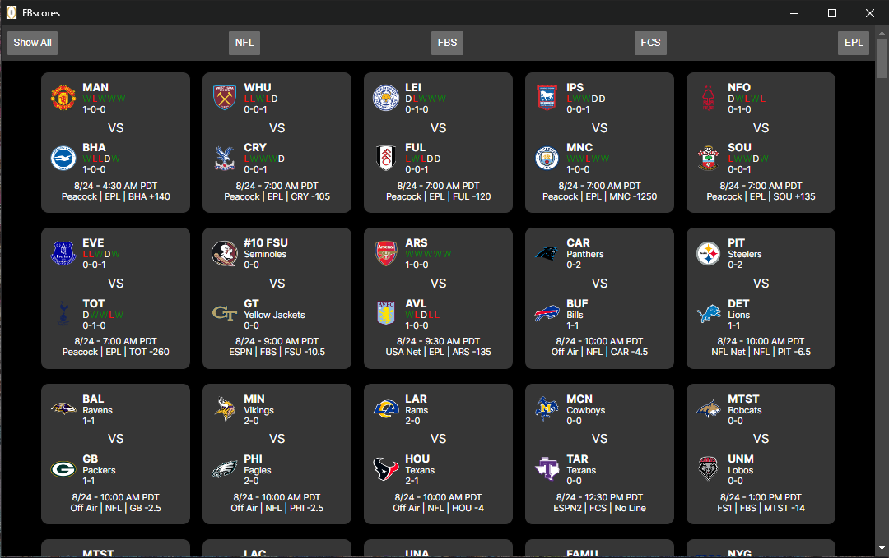
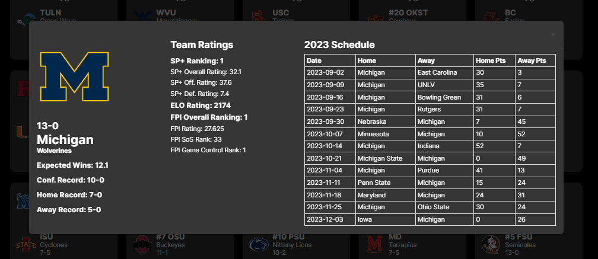
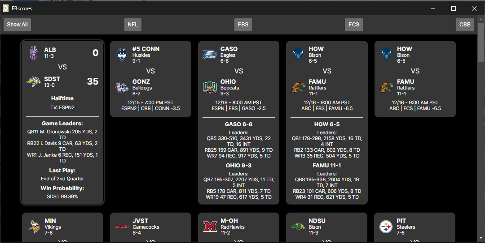

# CFBScores React

A basic scoreboard app + team statistical reference for College Football and more. Links live games to FuboTV and other online providers for easy multi-boxing. Powered by [cfbscores_py](https://github.com/npoet/cfbscores_py)

## Install
Requires the latest LTS version (or above) of Node.js + Next.js (can be installed via chosen node pm)

## Getting Started

First, run the development server:

```bash
npm run dev
# or
yarn dev
# or
pnpm dev
# or
bun dev
```

Open [http://localhost:3000](http://localhost:3000) with your browser to see the result. Requires [cfbscores_py](https://github.com/npoet/cfbscores_py) running at localhost:8000 to display content as shown below.

### Examples (see live site for updated styles):
Main Page (All Sports):

Team Info Overlay - On Logo Click (FBS/FCS):

Expanded Cells on Click (American Football):



This app is provided as-is and was created solely for my personal use. Future implementation plans include expanding sport and TV provider support, as well as additional statistical sources. Suggestions are welcome.